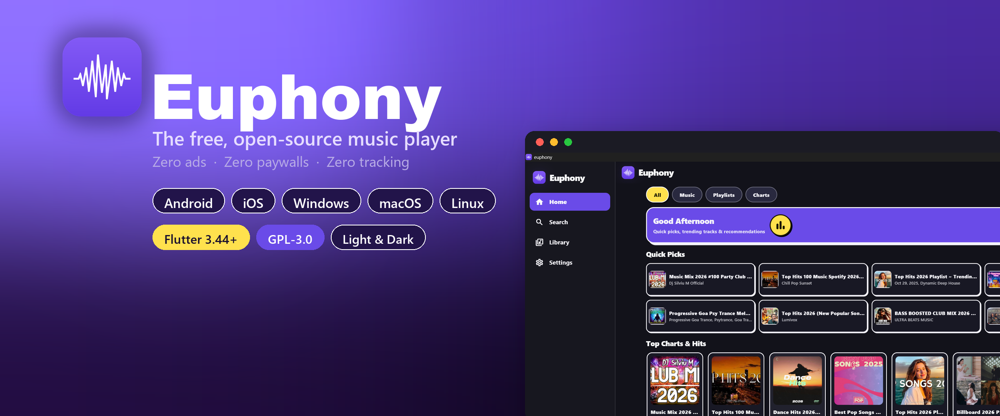

# Euphony

---

Life already has enough interruptions. Your music doesn't need 30-second unskippable ads for products you'll never buy. **Free, ad-free, and crafted with open-source love — now on every device.**

 

 

**Get Euphony for your platform**

  
  &nbsp;
  
  &nbsp;
  
  &nbsp;
  

  
  &nbsp;
  

📱 Android · 🍎 iOS · 🪟 Windows · 🍏 macOS · 🐧 Linux &nbsp;•&nbsp; iOS builds from source (App Store coming)

---

## Why Euphony?

- 🚫 **Zero Ads & Zero Tracking** — Music without interruptions or telemetry.
- 🎨 **Neo-Brutalist & Material 3 Design** — High-contrast slab borders, hard shadows, and expressive typography in both **Light** and **Dark** modes.
- ⚡ **Lightweight & Blazing Fast** — Engineered with Flutter & Riverpod for fluid 120Hz performance.
- ❤️ **100% Open Source** — Built by the community, for the community under the **GPL-3.0 License**.

---

## Core Features

| 🎧 Playback & Discovery | 📚 Library & Offline Storage |
| :--- | :--- |
| **• Universal Music Search** across tracks, albums, artists & playlists **• Queue Management** with seamless shuffle, repeat-all, and repeat-one **• Precision Speed Controls** (0.75x to 2.0x playback speed) **• Smart Sleep Timer** with automatic fade-out **• Native Media Controls** on lock screen, notification panel & wearables | **• Offline Downloads** for 100% offline local playback **• Persistent Playlists** with instant SQLite storage **• Adaptive Audio Quality** (High 256kbps AAC & Standard modes) **• One-Tap Backup & Restore** of playlists and downloads **• AMOLED Black Theme** for true OLED power saving |

---

## Download & Install

Grab the [**latest release**](https://github.com/MohammedNihadv/Euphony/releases/latest) and pick your platform:

| Platform | File | How to install |
| :--- | :--- | :--- |
| 🪟 **Windows** 10/11 | `euphony-windows-setup.exe` | Run the installer — no admin needed, adds Start-menu & desktop shortcuts. |
| 🍏 **macOS** | `euphony-macos.dmg` | Open the disk image and drag **Euphony** to Applications. |
| 🐧 **Linux** | `euphony-linux-x86_64.AppImage` | `chmod +x` the file and run it (requires `libmpv`). |
| 📱 **Android** | `app-arm64-v8a-release.apk` | ⭐ Best for 99% of phones (2017+). Tap to install. |
| 📱 Android (legacy) | `app-armeabi-v7a-release.apk` | Older 32-bit devices. |
| 📱 Android (x86) | `app-x86_64-release.apk` | Emulators & Intel Chromebooks. |
| 🍎 **iOS** | build from source | Requires Xcode + an Apple Developer account (App Store release planned). |

---

## Architecture & Tech Stack

| Technology | Role | Description |
| :--- | :--- | :--- |
| **[Flutter](https://flutter.dev)** | Core Framework | High-performance cross-platform UI engine |
| **[Riverpod](https://riverpod.dev)** | State Management | Type-safe, testable state & dependency injection |
| **[Drift](https://drift.simonbinder.eu)** + **SQLite** | Persistence Layer | Reactive local database for library and playlists |
| **just_audio** + **audio_service** | Audio Playback | Background audio playback with native OS media integration |
| **go_router** | Navigation | Declarative URL-based app routing |

---

## Contributing

We welcome contributions from developers, designers, and music lovers!

1. **Fork** the repository on GitHub.
2. **Clone** your fork locally and create a feature branch (`git checkout -b feature/amazing-feature`).
3. **Commit** your changes (`git commit -m 'feat: add amazing feature'`).
4. **Push** to your branch (`git push origin feature/amazing-feature`).
5. Open a **Pull Request** and describe your improvements!

---

## License

Euphony is free software released under the **[GNU General Public License v3.0 (GPL-3.0)](LICENSE)**.
